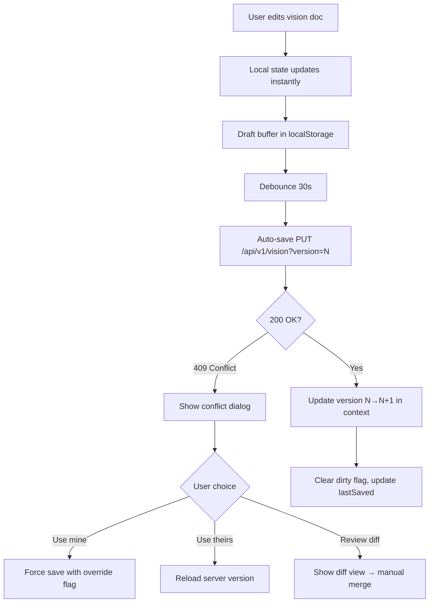
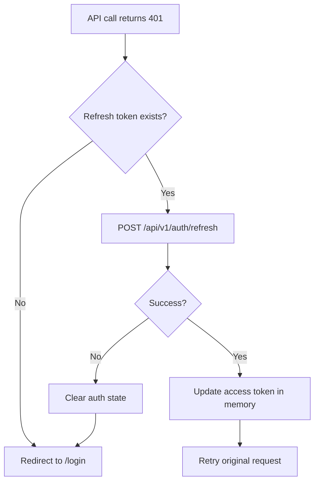

# Component Specifications

Component hierarchy and state management patterns for the Living Product Vision Platform. Derived from the 8 wireframes in `docs/wireframes/`, the route map and flows in `docs/user-flows.md`, and the functional requirements in `docs/functional-requirements.md`.

---

## 1. Component Tree

### 1.1 Topology Overview

```
<App>
 ├── <AuthProvider>            ← Auth context (JWT, roles)
 ├── <ThemeProvider>            ← Design system tokens (colors, spacing, typography)
 ├── <VisionProvider>          ← Vision document + version context
 └── <Router>
      ├── <AppLayout>          ← Persistent shell
      │    ├── <SidebarNav>         │  Desktop: 260px fixed sidebar
      │    ├── <MobileNav>          │  Mobile: bottom tab bar + hamburger
      │    ├── <Breadcrumb>         │  Deep-route context
      │    ├── <NotificationsBell>  │  Global notification indicator
      │    └── <Outlet>             │  Page content
      │         ├── <DashboardPage>
      │         ├── <ProjectsListPage>
      │         ├── <ProjectDetailPage>
      │         ├── <TaskBoardPage>
      │         ├── <NewProjectPage>
      │         ├── <AgentPerformancePage>
      │         ├── <SettingsPage>
      │         └── <MobileDashboardPage>
      └── <Modals>              ← Global modal stack
           ├── <TaskDetailModal>
           ├── <ConfirmModal>
           ├── <ApiKeyModal>
           └── <CreateProjectModal>
```

### 1.2 Layout Components

| Component | Responsibility | State | Slots |
|-----------|---------------|-------|-------|
| `AppLayout` | Shell frame: sidebar + header + content area + modal portal | `sidebarCollapsed` (desktop), `mobileMenuOpen` | `sidebar`, `header`, `content` |
| `SidebarNav` | 260px fixed left nav with icon + label items | `activeRoute` | — |
| `MobileNav` | Bottom tab bar (5 items) + hamburger drawer overlay | `activeTab`, `drawerOpen` | — |
| `Breadcrumb` | Breadcrumb trail for deep routes | `segments[]` (derived from route) | — |
| `NotificationsBell` | Bell icon + unread count badge | `unreadCount` | — |
| `PageHeader` | Per-page title + optional action buttons | — | `title`, `actions`, `metadata` |

### 1.3 Page Components

#### 1.3.1 DashboardPage (`/dashboard`)

```
<DashboardPage>
 ├── <PageHeader title="Dashboard" />
 ├── <MetricsRow>
 │    ├── <MetricCard label="Active Projects" value="12" trend="+2" />
 │    ├── <MetricCard label="Completed" value="47" trend="+5" />
 │    ├── <MetricCard label="Success Rate" value="94%" trend="stable" />
 │    └── <MetricCard label="Total Spend" value="$1,240" trend="+12%" />
 ├── <ActiveProjectsSection>
 │    └── <ProjectProgressCard>  (×N, max 3)
 │         ├── <ProgressBar value={75} />
 │         └── <AgentDotRow />
 ├── <ActivityFeed>
 │    └── <ActivityItem>  (×N)
 │         ├── <AgentBadge type="pm|architect|dev|review|qa|devops" />
 │         └── <ActivityText />
 └── <AgentStatusRow>
      └── <AgentDot status="idle|working|error|offline" label="PM" />  (×6)
```

#### 1.3.2 ProjectsListPage (`/projects`)

```
<ProjectsListPage>
 ├── <PageHeader title="Projects">
 │    └── <Button icon="plus">New Project</Button>
 ├── <FilterBar>
 │    ├── <SearchInput placeholder="Search projects..." />
 │    └── <StatusFilter options={["All", "Active", "Completed", "Paused"]} />
 └── <ProjectGrid>
      └── <ProjectCard>  (×N)
           ├── <ProjectTitle />
           ├── <ProgressBar value={42} />
           ├── <StatusBadge status="active|completed|paused" />
           ├── <AgentDotRow />
           └── <Timestamp text="2h ago" />
```

#### 1.3.3 ProjectDetailPage (`/projects/[id]`)

```
<ProjectDetailPage>
 ├── <PageHeader title={projectName} subtitle={projectId} />
 ├── <ProjectTabs tabs={["Pipeline", "Tasks", "Activity"]} />
 ├── <PipelineVisual stages={6}>
 │    └── <PipelineStage>  (×6)
 │         ├── <StageIcon state="done|active|pending" />
 │         └── <StageLabel text="Request|Analysis|Planning|...|Deploy" />
 ├── <QualityGatesRow>
 │    └── <QualityGateCard gate={1-4}>  (×4)
 │         ├── <GateStatusIndicator state="passed|running|pending" />
 │         └── <GateLabel text="Code Review|Testing|Deployment|Production" />
 ├── <TwoColumnLayout>
 │    ├── <TaskList>  (left column)
 │    │    └── <TaskCard>  (×N)
 │    │         ├── <TaskTitle />
 │    │         ├── <AgentBadge type="dev" />
 │    │         ├── <PriorityBadge level="high|medium|low" />
 │    │         └── <StatusBadge status="todo|in_progress|review|done" />
 │    └── <ActivityTimeline>  (right column)
 │         └── <ActivityItem>  (×N)
 │              ├── <AgentBadge />
 │              ├── <ActivityText />
 │              └── <Timestamp />
 └── <ChatPanel>  (floating/fixed)
      ├── <ChatMessages />
      └── <ChatInput />
```

#### 1.3.4 TaskBoardPage (`/tasks`)

```
<TaskBoardPage>
 ├── <PageHeader title="Task Board" />
 ├── <FilterBar>
 │    ├── <ProjectFilter dropdown />
 │    ├── <AgentFilter dropdown />
 │    └── <PriorityFilter dropdown />
 └── <KanbanBoard columns={4}>
      └── <KanbanColumn>  (×4)
           ├── <ColumnHeader title="TODO|IN PROGRESS|REVIEW|DONE" count={N} />
           └── <TaskCard>  (draggable, ×N)
                ├── <TaskTitle />
                ├── <AgentBadge type="dev" />
                ├── <PriorityBadge level="high" />
                ├── <ProjectLabel text="Auth Service" />
                └── <TaskId text="T-42" />
```

#### 1.3.5 NewProjectPage (`/projects/new`)

```
<NewProjectPage>
 ├── <PageHeader title="New Project" />
 └── <MultiStepForm steps={3}>
      ├── <StepPanel step={1} title="Describe">
      │    ├── <TextArea label="Project Description" minLength={50} />
      │    └── <ValidationHint />
      ├── <StepPanel step={2} title="Configure">
      │    ├── <SelectInput label="Tech Stack" options={["Go/Gin", "Python", "Rust"]} />
      │    ├── <SelectInput label="Deploy Target" options={["AWS", "Vercel", "Railway", "Self-hosted"]} />
      │    └── <ToggleGroup label="Agents">
      │         ├── <AgentToggle agent="pm" enabled />
      │         ├── <AgentToggle agent="architect" enabled />
      │         └── <AgentToggle agent="developer" enabled />
      └── <StepPanel step={3} title="Review">
           ├── <SummaryCard />
           └── <Button type="submit">Create Project</Button>
      <StepIndicator current={1|2|3} />
```

#### 1.3.6 AgentPerformancePage (`/agents`)

```
<AgentPerformancePage>
 ├── <PageHeader title="Agent Performance" />
 ├── <GlobalFilters>
 │    ├── <DateRangePicker />
 │    └── <ProjectFilter dropdown />
 ├── <AgentCardsGrid>
 │    └── <AgentCard>  (×6)
 │         ├── <AgentAvatar type="pm|architect|dev|review|qa|devops" />
 │         ├── <UtilizationDots rate={0.85} />
 │         ├── <StatRow label="Tasks" value="24" />
 │         ├── <StatRow label="Avg Time" value="3.2m" />
 │         └── <StatRow label="Cost" value="$14.50" />
 └── <AgentDetailPanel>  (expandable/overlay)
      ├── <UtilizationChart data={...} type="bar" />
      ├── <RecentTasksList>
      │    └── <TaskRow>  (×N)
      └── <ErrorRateIndicator rate={0.02} retries={3} />
```

#### 1.3.7 SettingsPage (`/settings`)

```
<SettingsPage>
 ├── <PageHeader title="Settings" />
 └── <TwoColumnLayout>
      ├── <SettingsNav>
      │    └── <VerticalTab label="General|Integrations|Notifications|Billing|Security" />  (×5)
      └── <SettingsPanel>
           ├── <GeneralSettings />
           │    ├── <TextField label="Platform Name" />
           │    ├── <SelectInput label="Default Stack" />
           │    ├── <SelectInput label="Deploy Target" />
           │    └── <NumberInput label="Budget Limit" />
           ├── <IntegrationsSettings />
           │    ├── <IntegrationCard service="GitHub" connected />
           │    ├── <IntegrationCard service="AWS" connected />
           │    ├── <IntegrationCard service="Slack" disconnected />
           │    └── <IntegrationCard service="Webhook" />
           ├── <NotificationsSettings />
           │    └── <ToggleRow label="Project Done" />
           │         (×5: Gate Failed, Agent Error, Budget 80%, Daily Summary)
           ├── <BillingSettings />
           │    ├── <UsageChart />
           │    ├── <BudgetAlertCard />
           │    └── <InvoiceHistory />
           └── <SecuritySettings />
                └── <MaskedApiKey provider="OpenAI|Anthropic" />
```

#### 1.3.8 MobileDashboardPage (viewport ≤ 768px)

```
<MobileDashboardPage>
 ├── <MobileHeader>
 │    ├── <HamburgerButton />
 │    ├── <PageTitle text="Dashboard" />
 │    └── <NotificationsBell />
 ├── <MobileMetricsRow>
 │    └── <MetricCard compact label="Active|Completed" value="12|47" />
 ├── <ProgressOverview>
 │    └── <ProgressCard label="Overall" value={89} />
 └── <ActiveProjectsSection>
      └── <ProjectProgressCard compact>  (×3)
           ├── <ProgressBar />
           └── <ProjectName />
```

### 1.4 Shared / Reusable Components

#### 1.4.1 UI Primitives

| Component | Props | Notes |
|-----------|-------|-------|
| `Button` | `variant: primary|secondary|ghost|danger`, `size: sm|md|lg`, `icon`, `loading` | Loading state shows spinner, disables click |
| `TextField` | `label`, `value`, `onChange`, `error`, `hint`, `disabled` | Error state shows red border + message |
| `TextArea` | Same as TextField + `minLength`, `maxLength`, `rows` | Character count when maxLength set |
| `SelectInput` | `label`, `options[]`, `value`, `onChange`, `placeholder` | Native or custom dropdown |
| `ToggleSwitch` | `label`, `checked`, `onChange`, `disabled` | Animated toggle |
| `SearchInput` | `placeholder`, `value`, `onChange`, `debounceMs=300` | Debounced onChange |
| `NumberInput` | `label`, `value`, `min`, `max`, `step`, `onChange` | With increment/decrement buttons |
| `Modal` | `open`, `onClose`, `title`, `size: sm|md|lg|fullscreen`, `children` | Portal-rendered, ESC to close, backdrop click to close |
| `Toast` | `type: success|error|info|warning`, `message`, `duration=3000` | Auto-dismissing |
| `Spinner` | `size: sm|md|lg` | CSS-only spinning indicator |
| `Skeleton` | `variant: text|card|circle`, `width`, `height` | Loading placeholder |
| `Badge` | `variant: status|priority|agent`, `value` | Color-coded pill |
| `Avatar` | `type: user|agent`, `name`, `size: sm|md|lg` | Agent uses agent-specific color |
| `ProgressBar` | `value: 0-100`, `size: sm|md`, `color` | Animated fill |
| `Breadcrumb` | `segments: [{label, href}][]` | Last segment is plain text |

#### 1.4.2 Pattern Components

| Component | Composition | Use Cases |
|-----------|-------------|-----------|
| `MetricCard` | Icon + value + label + trend indicator + optional sparkline | Dashboard metrics, agent stats |
| `ProjectCard` | Title + progress + status badge + agent dots + timestamp | Projects grid, search results |
| `TaskCard` | Title + agent badge + priority badge + project label + ID | Kanban columns, task list |
| `ActivityItem` | Agent badge + text + timestamp | Activity feed, timeline |
| `AgentBadge` | Colored dot + agent name/label | Every context where agents appear |
| `StatusBadge` | Colored pill with icon + text | Pipeline stages, gates, task status |
| `PriorityBadge` | Color-coded badge (high=red, medium=yellow, low=gray) | Task cards, filters |
| `QualityGateCard` | Gate number + status icon + label + optional detail | Project detail |
| `PipelineStage` | Step circle (done/active/pending) + label + pulse animation | Project detail |
| `AgentCard` | Avatar + utilization + stat rows | Agent performance grid |
| `IntegrationCard` | Service icon + name + connected/disconnected state + action button | Settings > Integrations |
| `ToggleRow` | Label + description + toggle switch | Settings > Notifications |
| `MaskedApiKey` | Provider name + masked key (●●●●●●) + reveal/edit action | Settings > Security |
| `FilterBar` | Composable row of filter controls with URL sync | Task board, agents, projects |
| `StepIndicator` | Horizontal step numbers (1/2/3) with labels | New project multi-step form |

### 1.5 Component Hierarchy Summary

```
Layout Layer
 ├── AppLayout
 │    ├── SidebarNav / MobileNav
 │    ├── Breadcrumb
 │    ├── Toast (global)
 │    └── Modal (portal)

Page Layer (one per route)
 ├── DashboardPage
 ├── ProjectsListPage
 ├── ProjectDetailPage
 ├── TaskBoardPage
 ├── NewProjectPage
 ├── AgentPerformancePage
 ├── SettingsPage
 └── MobileDashboardPage

Feature Layer (reusable across pages)
 ├── MetricCard, ProjectCard, TaskCard, ActivityItem
 ├── AgentBadge, StatusBadge, PriorityBadge
 ├── QualityGateCard, PipelineStage
 ├── FilterBar, StepIndicator
 ├── AgentCard, IntegrationCard
 └── ChatPanel

Primitive Layer (design system)
 ├── Button, TextField, TextArea, SelectInput
 ├── ToggleSwitch, SearchInput, NumberInput
 ├── Modal, Toast, Spinner, Skeleton
 ├── Badge, Avatar, ProgressBar, Breadcrumb
 └── ToggleRow, MaskedApiKey, UtilizationChart
```

---

## 2. State Management Architecture

### 2.1 State Topology

```
┌──────────────────────────────────────────────────┐
│                  GLOBAL STATE                     │
│  ┌──────────┐ ┌──────────┐ ┌──────────────────┐  │
│  │  Auth    │ │  Theme   │ │ VisionProvider    │  │
│  │  Context │ │  Context │ │(doc + version)    │  │
│  └──────────┘ └──────────┘ └──────────────────┘  │
│  ┌──────────┐ ┌──────────┐ ┌──────────────────┐  │
│  │  UI      │ │  Notif.  │ │    Cache         │  │
│  │  Context │ │  Context │ │ (React Query)    │  │
│  └──────────┘ └──────────┘ └──────────────────┘  │
├──────────────────────────────────────────────────┤
│                 PAGE STATE                        │
│  ┌──────────┐ ┌────────────┐ ┌───────────────┐   │
│  │ Current  │ │ Filters /  │ │  Form State   │   │
│  │ Route    │ │ Pagination │ │  (per page)   │   │
│  └──────────┘ └────────────┘ └───────────────┘   │
├──────────────────────────────────────────────────┤
│               COMPONENT STATE                     │
│  ┌──────────┐ ┌──────────┐ ┌───────────────┐     │
│  │  UI      │ │  Form    │ │ Drag / Drop   │     │
│  │  Toggles │ │  Inputs  │ │ (Kanban)      │     │
│  └──────────┘ └──────────┘ └───────────────┘     │
└──────────────────────────────────────────────────┘
```

### 2.2 State Layers

| Layer | Scope | Technology | Examples |
|-------|-------|-----------|----------|
| **Server State** | Global | React Query (TanStack Query) | Projects, tasks, agents, vision doc, metrics |
| **Auth State** | Global | React Context + localStorage | JWT tokens, user profile, roles |
| **Theme State** | Global | React Context | Color mode, font scaling, reduced motion |
| **UI State** | Global | React Context | Sidebar collapsed, active modal, toasts |
| **Notification State** | Global | React Context | Unread count, notification queue |
| **Vision State** | Global | React Context | Current vision document, version, editing session |
| **Route State** | Page-level | URL (Next.js searchParams) | Filters, pagination cursors, active tabs |
| **Form State** | Component | React Hook Form / local useState | Multi-step project creation, settings forms |
| **DnD State** | Component | @dnd-kit / local state | Kanban column drag, task reorder |

### 2.3 Context Providers

#### 2.3.1 AuthProvider

```
<AuthProvider>
  value: {
    user: { id, name, email, role } | null,
    login(email, password) → Promise<void>,
    logout() → void,
    refreshToken() → Promise<string>,
    hasPermission(requiredRole) → boolean,
    isLoading: boolean,
    error: string | null,
  }
```

**Persistence:** JWT access token in memory, refresh token in httpOnly cookie.
**On mount:** Attempt silent refresh via `/api/v1/auth/refresh`.
**On 401:** Interceptor calls `refreshToken()`, retries original request. If refresh fails → redirect to login.
**Roles:** `admin`, `product_manager`, `engineering_lead`, `designer`, `analyst`, `qa`, `security`, `viewer`

#### 2.3.2 ThemeProvider

```
<ThemeProvider>
  value: {
    mode: 'light' | 'dark',
    toggleMode() → void,
    prefersReducedMotion: boolean,
    fontScale: 1 | 1.25 | 1.5,  // accessibility
    tokens: { colors, spacing, typography, borderRadius },  // from API
  }
```

**Persistence:** `mode` in localStorage, `prefersReducedMotion` from `prefers-reduced-motion` media query.
**Tokens:** Fetched from `GET /api/v1/design-system` on mount, cached.
**CSS Variables:** All tokens set as CSS custom properties on `:root` for runtime theming.

#### 2.3.3 VisionProvider

```
<VisionProvider>
  value: {
    document: { id, version, problem_statement, vision_statement, ... },
    history: Revision[],
    currentEditor: { userId, name } | null,  // collaborative lock
    acquireLock() → Promise<boolean>,
    releaseLock() → void,
    save(changes, changeReason, evidenceLinks) → Promise<void>,
    propose(changes, changeReason) → Promise<Proposal>,
    isDirty: boolean,
    lastSaved: Date,
  }
```

**Persistence:** Server-side via API (vision is the canonical source).
**Optimistic Locking:** `version` field on document — `PUT` with wrong version returns `409 Conflict`.
**Auto-save:** Draft buffer in localStorage with debounced (30s) server sync. On crash recovery, prompt "Restore unsaved changes?"
**Change Proposals:** Local draft until explicitly submitted for review.

#### 2.3.4 NotificationProvider

```
<NotificationProvider>
  value: {
    queue: Notification[],
    unreadCount: number,
    push(notification) → void,
    dismiss(id) → void,
    markAllRead() → void,
  }
```

**Types:** `agent_task_done`, `gate_passed`, `gate_failed`, `agent_error`, `budget_alert`, `daily_summary`
**Persistence:** Notifications batch-fetched on page load; new ones arrive via SSE or polling (30s interval).
**Display:** Toast for transient notifications, bell badge for persisted ones.

#### 2.3.5 UIContext (global UI state)

```
<UIContext>
  value: {
    sidebarCollapsed: boolean,
    setSidebarCollapsed(b) → void,
    activeModal: ModalType | null,
    openModal(type, props) → void,
    closeModal() → void,
    toasts: Toast[],
    addToast(toast) → void,
    removeToast(id) → void,
  }
```

**Persistence:** None (UI state resets on page navigation).
**Sidebar:** Desktop only; preference could be persisted if needed.
**Modals:** Rendered via portal under `<AppLayout>`, closed on ESC / backdrop click.

### 2.4 Server State (React Query)

#### 2.4.1 Query Keys

```
queryKeys = {
  projects: {
    all:    ['projects'],
    list:   (filters) => ['projects', 'list', filters],
    detail: (id)     => ['projects', 'detail', id],
  },
  tasks: {
    all:    ['tasks'],
    list:   (filters) => ['tasks', 'list', filters],
    detail: (id)     => ['tasks', 'detail', id],
  },
  agents: {
    all:      ['agents'],
    metrics:  (filters) => ['agents', 'metrics', filters],
    history:  (agentId) => ['agents', 'history', agentId],
  },
  vision: {
    document:  ['vision', 'document'],
    history:   ['vision', 'history'],
    diff:      (from, to) => ['vision', 'diff', from, to],
  },
  settings: {
    all:       ['settings'],
    section:   (name) => ['settings', 'section', name],
  },
  designSystem: {
    tokens:    ['design-system', 'tokens'],
  },
}
```

#### 2.4.2 Cache Strategy

| Data | Stale Time | Cache Time | Refetch On | Notes |
|------|-----------|-----------|------------|-------|
| Projects list | 30s | 5min | Window focus, mutation invalidation | Stale while revalidate |
| Project detail | 15s | 5min | Window focus, mutation | Higher freshness need |
| Tasks (kanban) | 10s | 2min | Drag-drop mutation, poll | Near-real-time for collaboration |
| Agent metrics | 60s | 5min | Manual refresh | Lower update frequency |
| Vision doc | 5min | 30min | Manual save | Version-controlled, explicit saves |
| Design tokens | ∞ | ∞ | Page refresh | Never changes mid-session |
| Settings | 2min | 10min | Save mutation | |

#### 2.4.3 Mutation Side Effects

```
CreateProject:
  POST /api/v1/projects → invalidate ['projects', 'list']
  → redirect /projects/[newId]

UpdateTaskStatus (kanban drag):
  PATCH /api/v1/tasks/{id}/status → optimistic update ['tasks', 'list']
  → on error: rollback + toast error
  → on success: invalidate ['agents', 'metrics'] (agent may have been triggered)

SaveVision:
  PUT /api/v1/vision → invalidate ['vision', 'document']
  → on success: toast "Saved — version N"
  → on 409: show conflict resolution dialog

ToggleIntegration:
  POST /api/v1/settings/integrations/{id}/toggle → invalidate ['settings', 'section', 'integrations']
```

### 2.5 URL as Source of Truth

The URL (search params) is the canonical source for page-level filter and pagination state:

```
/tasks?project=auth-service&agent=dev&priority=high
/agents?from=2026-06-01&to=2026-06-10&project=auth-service
/settings?tab=integrations
```

**Pattern:** Read filters from `useSearchParams()` on mount, update them via `router.push({ query })` on change.
**Persistence:** URL is shareable and survives browser refresh.
**Uncontrolled inputs:** Filter fields use initial values from URL, then URL changes drive value changes (not the other way around).

### 2.6 State Flow Diagrams

#### 2.6.1 Data Fetching Lifecycle

```mermaid
flowchart LR
    A[Page Mount] --> B{Data in cache?}
    B -->|Yes, fresh| C[Render cached data]
    B -->|Yes, stale| D[Render stale data + refetch]
    B -->|No| E[Show skeleton loader]
    D --> F[Background refetch]
    F --> G{Success?}
    G -->|Yes| H[Update cache → re-render]
    G -->|No| I[Retry (3x exponential backoff)]
    I -->|All fail| J[Show error state + retry button]
    E --> F
```

#### 2.6.2 Optimistic Kanban Drag

```mermaid
flowchart TD
    A[User starts drag] --> B[Show drag overlay]
    B --> C[Drop on new column]
    C --> D[Optimistic: move card in UI immediately]
    D --> E[Fire PATCH /api/v1/tasks/{id}/status]
    E --> F{200 OK?}
    F -->|Yes| G[Invalidate task queries for consistency]
    F -->|No| H[Rollback: return card to original column]
    H --> I[Show error toast: "Failed to move task"]
    G --> J[Optional: invalidate agent metrics if agent triggered]
```

#### 2.6.3 Vision Document Save



#### 2.6.4 Auth Token Refresh



### 2.7 Local State Guidelines

| State Type | Where to Keep | Don't Put In |
|-----------|--------------|-------------|
| Form input values (controlled) | `useState` in form component | Global context, URL params |
| UI toggles (accordion, dropdown, tab) | `useState` in container component | URL params, React Query cache |
| Drag state (ghost position) | `useState` in DnD context provider | Anywhere else |
| Debounced search value | `useState` + `useEffect(debounce)` in search component | URL params (raw value), global state |
| Modal open/close | `useState` in parent that opens it, or UIContext for app-wide modals | React Query cache |
| Selected item (table row, kanban card) | `useState` in page component | URL params for transient selection |
| Skeleton show/hide | Derived from React Query `isLoading` | Manual boolean state |
| Error display | Derived from React Query `isError` + `error` | Manual state (prefer error boundary) |

### 2.8 State by Page

| Page | Server State (React Query) | URL Params | Local State | Context |
|------|---------------------------|-----------|-------------|---------|
| Dashboard | `projects`, `agents/metrics`, `vision` | — | — | `Auth`, `UI` |
| Projects List | `projects/list` | `status`, `search`, `page` | Search input raw value | `Auth` |
| Project Detail | `projects/detail/[id]`, `tasks/list`, `agents/history` | — | Active tab, Chat input | `Auth`, `Vision` (contextual) |
| Task Board | `tasks/list` | `project`, `agent`, `priority` | Active drag state, column scroll | `Auth` |
| New Project | — | `step` (optional deep-link) | Multi-step form state, validation errors | `Auth` |
| Agent Performance | `agents/metrics`, `agents/history/[id]` | `from`, `to`, `project` | Selected agent detail | `Auth` |
| Settings | `settings/section/[name]` | `tab` | Dirty form tracking, save status | `Auth`, `Theme` |
| Mobile Dashboard | `projects`, `agents/metrics` | — | Drawer open, active tab | `Auth`, `UI` |

### 2.9 Performance Considerations

| Technique | Where | Why |
|-----------|-------|-----|
| **React.memo** | `TaskCard`, `MetricCard`, `ActivityItem`, `AgentBadge` | Re-rendered in lists, props change infrequently |
| **useMemo** | Filtered/sorted lists from query data | Avoids recomputation on parent re-render |
| **useCallback** | `onChange`, `onDrop`, filter handlers | Stable references for memoized children |
| **Virtualization** | `TaskCard` list in kanban columns (50+ tasks) | DOM pollution with many cards |
| **Code splitting** | Per-page dynamic imports (`next/dynamic`) | Initial bundle size, each page lazy-loads |
| **Skeleton + Suspense** | All list/detail pages | Perceived performance, structured loading |
| **Debounced search** | `SearchInput` (300ms) | Avoids API call per keystroke |
| **Optimistic updates** | Kanban drag, toggle switch | Instant UI feedback, rollback on error |
| **Prefetch on hover** | Project cards → project detail | Hover triggers data fetch before click |
| **CSS animations** | Loading states, pipeline pulse, toast | GPU-accelerated, no JS main-thread work |

### 2.10 Error Handling Strategy

| Layer | Pattern | Example |
|-------|---------|---------|
| **API errors** | React Query `onError` → toast | "Failed to load projects. Retry?" |
| **Form validation** | Inline field errors | "Project name is required" |
| **Network offline** | Top banner + offline indicator | "Offline — changes saved locally" |
| **Auth expiry** | Interceptor → refresh → retry or redirect | Silent refresh; redirect to login if expired |
| **404** | Error boundary → "Not found" page | "Project not found" with link to projects list |
| **500** | Error boundary → "Something broke" page | "Something went wrong" with retry + support link |
| **Rate limit (429)** | Retry with backoff (3x) + toast | "Too many requests. Waiting..." |
| **Conflict (409)** | Vision save conflict dialog | "Another user saved version N+1. Review changes?" |
| **Render errors** | React Error Boundary (per-page) | Page-level fallback, nav unaffected |
| **Mutation errors** | Optimistic rollback + toast | Kanban drag rolls back, shows error |

---

## 3. Component Responsibility Matrix

| Component | Server Data | User Input | Side Effects | Accessibility |
|-----------|-----------|-----------|-------------|---------------|
| `SidebarNav` | None | Route click | Navigate | `role="navigation"`, aria-current |
| `KanbanColumn` | `tasks/list` (via query) | Drag, drop | PATCH task status | `role="listbox"`, aria-dropeffect |
| `TaskCard` | None (gets data via props) | Click | Open detail modal | `role="button"`, tabIndex=0 |
| `MetricCard` | `agents/metrics` or props | None | None | `aria-label` with value+label |
| `ChatPanel` | `chat/history/[projectId]` | Text input, send | POST chat message | `role="log"`, aria-live |
| `PipelineVisual` | `projects/detail/[id]` (pipeline) | None | None | aria-label per stage |
| `MultiStepForm` | None | All form fields | POST /projects | `role="form"`, fieldset per step |
| `SettingsPanel` | `settings/section/[name]` | Form fields, toggles | PATCH settings | Labels associated, error announcements |
| `FilterBar` | None | Select, search | Update URL params | `role="search"`, label for each filter |

---

## 4. Component Dependencies & Data Flow

```
┌──────────────────────────────────────────────────────┐
│                   React Query                         │
│  ┌──────────┐ ┌──────────┐ ┌──────────┐ ┌─────────┐ │
│  │ projects │ │  tasks   │ │  agents  │ │settings │ │
│  └────┬─────┘ └────┬─────┘ └────┬─────┘ └────┬────┘ │
│       │            │            │            │       │
└───────┼────────────┼────────────┼────────────┼───────┘
        │            │            │            │
        ▼            ▼            ▼            ▼
┌──────────────────────────────────────────────────────────────────────────┐
│                          Context Layer                                   │
│  ┌────────────┐ ┌────────────┐ ┌──────────┐ ┌────────────┐ ┌─────────┐ │
│  │ AuthContext│ │ThemeContext│ │UIContext │ │VisionCtx  │ │NotifCtx │ │
│  └─────┬──────┘ └─────┬──────┘ └────┬─────┘ └─────┬──────┘ └────┬────┘ │
│        │              │             │             │             │       │
└────────┼──────────────┼─────────────┼─────────────┼─────────────┼───────┘
         │              │             │             │             │
         ▼              ▼             ▼             ▼             ▼
┌──────────────────────────────────────────────────────────────────────────┐
│                           Page Components                                │
│  ┌──────────┐ ┌──────────┐ ┌──────────┐ ┌─────────┐ ┌──────────────┐   │
│  │Dashboard │ │Projects  │ │Project   │ │Task     │ │AgentPerf     │   │
│  │Page      │ │ListPage  │ │DetailPage│ │BoardPage│ │Page          │   │
│  └────┬─────┘ └────┬─────┘ └────┬─────┘ └────┬────┘ └──────┬───────┘   │
│       │            │            │            │             │           │
└───────┼────────────┼────────────┼────────────┼─────────────┼───────────┘
        │            │            │            │             │
        ▼            ▼            ▼            ▼             ▼
┌──────────────────────────────────────────────────────────────────────────┐
│                       Feature Components                                 │
│  ┌─────────┐ ┌──────────┐ ┌──────────┐ ┌──────────┐ ┌────────────────┐ │
│  │Metric   │ │Project   │ │TaskCard  │ │Pipeline  │ │AgentCard       │ │
│  │Card     │ │Card      │ │          │ │Visual    │ │                │ │
│  └─────────┘ └──────────┘ └──────────┘ └──────────┘ └────────────────┘ │
│  ┌─────────┐ ┌──────────┐ ┌──────────┐ ┌──────────┐ ┌────────────────┐ │
│  │Activity │ │AgentBadge│ │Quality   │ │FilterBar │ │SettingsPanel   │ │
│  │Item     │ │          │ │GateCard  │ │          │ │                │ │
│  └─────────┘ └──────────┘ └──────────┘ └──────────┘ └────────────────┘ │
└──────────────────────────────────────────────────────────────────────────┘
                          │
                          ▼
┌──────────────────────────────────────────────────────────────────────────┐
│                          UI Primitives                                   │
│  ┌──────┐ ┌──────┐ ┌──────┐ ┌──────┐ ┌──────┐ ┌──────┐ ┌──────┐        │
│  │Button│ │Input │ │Modal │ │Toast │ │Badge │ │Avatar│ │Prog. │        │
│  │      │ │      │ │      │ │      │ │      │ │      │ │Bar   │        │
│  └──────┘ └──────┘ └──────┘ └──────┘ └──────┘ └──────┘ └──────┘        │
└──────────────────────────────────────────────────────────────────────────┘
```

---

## 5. Directory Structure

```
src/
├── components/
│   ├── layout/
│   │   ├── AppLayout.tsx
│   │   ├── SidebarNav.tsx
│   │   ├── MobileNav.tsx
│   │   ├── Breadcrumb.tsx
│   │   ├── PageHeader.tsx
│   │   └── NotificationsBell.tsx
│   ├── pages/
│   │   ├── DashboardPage.tsx
│   │   ├── ProjectsListPage.tsx
│   │   ├── ProjectDetailPage.tsx
│   │   ├── TaskBoardPage.tsx
│   │   ├── NewProjectPage.tsx
│   │   ├── AgentPerformancePage.tsx
│   │   ├── SettingsPage.tsx
│   │   └── MobileDashboardPage.tsx
│   ├── features/
│   │   ├── MetricCard.tsx
│   │   ├── ProjectCard.tsx
│   │   ├── TaskCard.tsx
│   │   ├── ActivityItem.tsx
│   │   ├── AgentBadge.tsx
│   │   ├── StatusBadge.tsx
│   │   ├── PriorityBadge.tsx
│   │   ├── QualityGateCard.tsx
│   │   ├── PipelineVisual.tsx
│   │   ├── PipelineStage.tsx
│   │   ├── AgentCard.tsx
│   │   ├── IntegrationCard.tsx
│   │   ├── FilterBar.tsx
│   │   ├── StepIndicator.tsx
│   │   ├── ChatPanel.tsx
│   │   ├── ActivityTimeline.tsx
│   │   ├── KanbanColumn.tsx
│   │   ├── ProjectGrid.tsx
│   │   ├── MetricsRow.tsx
│   │   ├── QualityGatesRow.tsx
│   │   └── MultiStepForm.tsx
│   ├── primitives/
│   │   ├── Button.tsx
│   │   ├── TextField.tsx
│   │   ├── TextArea.tsx
│   │   ├── SelectInput.tsx
│   │   ├── ToggleSwitch.tsx
│   │   ├── SearchInput.tsx
│   │   ├── NumberInput.tsx
│   │   ├── Modal.tsx
│   │   ├── Toast.tsx
│   │   ├── Spinner.tsx
│   │   ├── Skeleton.tsx
│   │   ├── Badge.tsx
│   │   ├── Avatar.tsx
│   │   ├── ProgressBar.tsx
│   │   ├── Breadcrumb.tsx
│   │   └── ToggleRow.tsx
│   └── modals/
│       ├── TaskDetailModal.tsx
│       ├── ConfirmModal.tsx
│       ├── ApiKeyModal.tsx
│       └── CreateProjectModal.tsx
├── providers/
│   ├── AuthProvider.tsx
│   ├── ThemeProvider.tsx
│   ├── VisionProvider.tsx
│   ├── NotificationProvider.tsx
│   └── UIProvider.tsx
├── hooks/
│   ├── useAuth.ts
│   ├── useVision.ts
│   ├── useProjectFilters.ts
│   ├── useKanbanDrag.ts
│   ├── useDebouncedSearch.ts
│   └── useAutoSave.ts
├── lib/
│   ├── api.ts          (axios/fetch wrapper with auth interceptor)
│   ├── queryKeys.ts    (centralized query key factory)
│   └── utils.ts
└── styles/
    ├── globals.css
    └── tokens.css
```

---

## 6. Key Design Decisions

| Decision | Choice | Rationale |
|----------|--------|-----------|
| **State management** | React Query (server) + React Context (global UI) + `useState` (local) | No Redux/Zustand overhead — server data is the dominant category; React Query handles caching, refetching, optimistic updates out of the box |
| **Auth token storage** | Access token in memory, refresh token in httpOnly cookie | XSS-safe (JS cannot read httpOnly cookie), refresh token never leaks |
| **URL as filter source** | `useSearchParams()` read on mount, push on change | Shareable URLs, survives refresh, no redundant state sync between URL and context |
| **Optimistic updates** | Kanban drag, toggle switches, integration connect/disconnect | Instant feedback is critical for drag-drop interaction; rollback on error with toast |
| **Auto-save** | Debounced 30s to localStorage + server sync | Vision document is the most critical data; crash recovery prevents data loss |
| **Stale-while-revalidate** | All list queries default to stale-while-revalidate | Users see cached data instantly, background refresh updates it; no loading spinners on revisit |
| **Component granularity** | Feature components own their layout composition; primitives are stateless | Pages compose features; features compose primitives. Primitives accept className for layout overrides |
| **Mobile adaptation** | Same page components, responsive CSS + MobileNav wrapper | No separate mobile route tree; layout switches via CSS media queries + `MobileDashboardPage` for the compact variant |
| **Error boundaries** | Per-page error boundaries | One failed page doesn't crash the whole app; nav and global UI remain functional |

---

*Generated for TASK-014 — builds on wireframes (`docs/wireframes/`), user flows (`docs/user-flows.md`), functional requirements (`docs/functional-requirements.md`), and API spec (`docs/api-spec.md`).*
