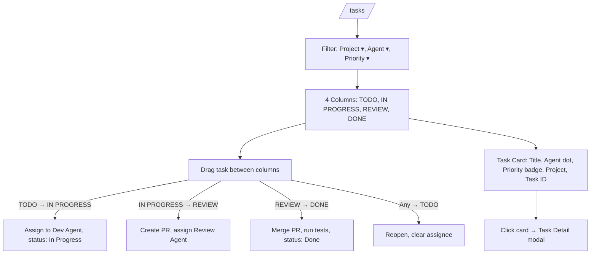
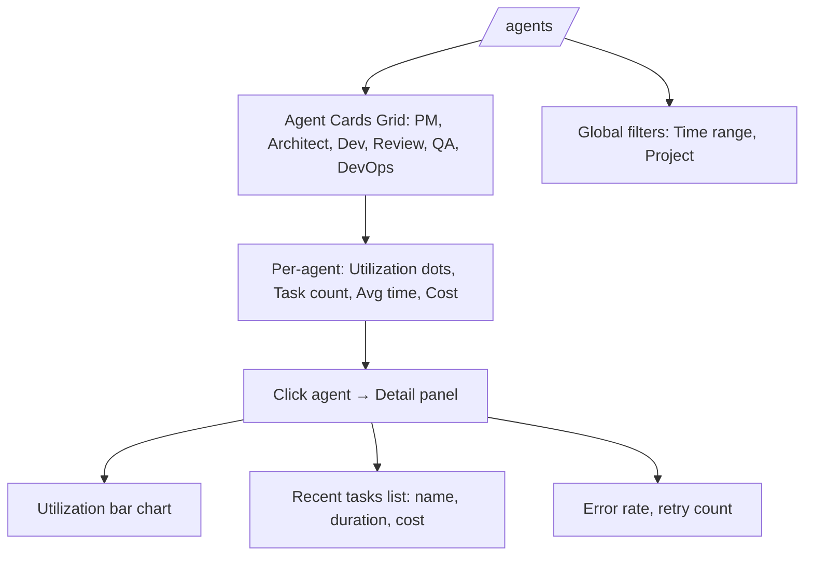

# User Flows — AI Software Factory

Navigation structure and interaction patterns derived from the low-fidelity wireframes in `docs/wireframes/`.

---

## 1. Navigation Structure

### 1.1 Primary Navigation (Desktop Sidebar)

| Section | Items | Route | Icon |
|---------|-------|-------|------|
| **Overview** | Dashboard, Projects | `/dashboard`, `/projects` | 📊, 📁 |
| **Work** | Task Board, Agents | `/tasks`, `/agents` | 📋, 🤖 |
| **Insights** | Performance, Cost Tracking | `/agents` (performance), `/settings` (billing) | 📈, 💰 |
| **System** | Settings | `/settings` | ⚙ |

**Desktop:** Fixed 260px left sidebar, persistent across all routes  
**Mobile:** Collapsed into hamburger menu (☰) + bottom tab bar (Dashboard, Projects, Agents, Settings)

### 1.2 Secondary Navigation

| Context | Pattern | Example |
|---------|---------|---------|
| Settings | Vertical tabs (General, Integrations, Notifications, Billing, Security) | `/settings` → General |
| Project Detail | Pipeline visual + two-column (Tasks / Activity) | `/projects/[id]` |
| Task Board | Filter row (Project, Agent, Priority) above kanban columns | `/tasks` |

---

## 2. Core User Flows

### 2.1 Flow: Create New Project

```mermaid
flowchart TD
    A[Dashboard / Projects] -->|Click + New Project| B[Modal: New Project Form]
    B -->|Fill: Name, Description, Stack, Env| C[Validate required fields]
    C -->|Valid| D[Create Project]
    C -->|Invalid| E[Show inline errors]
    D --> F[Route to /projects/[id]]
    F --> G[PM Agent decomposes requirements → Tasks]
    G --> H[Pipeline: Request → Analysis → Planning → Implementation...]
```

**Entry Points:** Dashboard header button, Projects list header button  
**Modal Fields:** Project Name (required), Description, Tech Stack (select), Deployment Target (select)  
**Success State:** Redirect to Project Detail with pipeline at "Request" stage  
**Agents Triggered:** PM Agent (task decomposition), Architect Agent (system design)

---

### 2.2 Flow: Project Detail — Track Progress

```mermaid
flowchart TD
    A[Projects List] -->|Click project card| B[/projects/[id]/]
    B --> C[Pipeline Visual: 6 stages]
    C --> D{Current Stage?}
    D -->|Request/Analysis/Planning| E[Show: Tasks pending, Agent activity]
    D -->|Implementation| F[Show: In-progress tasks, Dev Agent activity]
    D -->|Review| G[Show: PRs awaiting review, Review Agent activity]
    D -->|Testing| H[Show: QA running tests, test results]
    D -->|Deploy| I[Show: DevOps deploying, deployment status]
    E & F & G & H & I --> J[Quality Gates row: 4 gates]
    J --> K[Gate 1: Code Review ✓/◉/○]
    J --> L[Gate 2: Testing ◉/○]
    J --> M[Gate 3: Deployment ◉/○]
    J --> N[Gate 4: Production ○ (requires human)]
```

**Pipeline Stages:** Request → Analysis → Planning → Implementation → Review → Testing → Deploy  
**Visual States:** ✓ Done (green), ◉ Active (blue pulse), — Pending (gray)  
**Quality Gates:** Code Review, Testing, Deployment, Production (human approval)

---

### 2.3 Flow: Task Board — Kanban Workflow



**Columns Map to Pipeline:** TODO (Request/Analysis/Planning), IN PROGRESS (Implementation), REVIEW (Review), DONE (Testing/Deploy)  
**Drag-Drop:** Updates task status, triggers agent assignment  
**Filters:** Persist in URL query params (`?project=auth&agent=dev&priority=high`)

---

### 2.4 Flow: Agent Performance Monitoring



**Agent Colors:** PM (purple), Architect (cyan), Developer (green), Review (orange), QA (pink), DevOps (blue)  
**Metrics:** Tasks completed, avg duration, token cost, utilization %, error rate

---

### 2.5 Flow: Settings Configuration

```mermaid
flowchart TD
    A[/settings/] --> B[Left nav: General, Integrations, Notifications, Billing, Security]
    B --> C{Section}
    C -->|General| D[Platform name, Default stack, Deploy target, Budget limit]
    C -->|Integrations| E[GitHub ✓, AWS ✓, Slack ✗, Webhook Configure]
    C -->|Notifications| F[Toggles: Project done, Gate failed, Agent error, Budget 80%, Daily summary]
    C -->|Billing| G[Usage chart, Budget alerts, Invoice history]
    C -->|Security| H[API Keys: OpenAI, Anthropic (masked)]
    D & E & F & G & H --> I[Save Changes button per section]
```

**Integrations:** Connected (green badge) / Disconnected (gray badge + Connect button)  
**Notifications:** Toggle switches, persist to user preferences  
**Security:** API keys masked, update via modal with confirmation

---

### 2.6 Flow: Mobile Dashboard Quick Check

```mermaid
flowchart TD
    A[Open app on mobile] --> B[Status bar: time, battery]
    B --> C[Header: ☰ AI Factory 🔔]
    C --> D[Metrics row: Active (12), Completed (47)]
    D --> E[Overall progress: 89% bar]
    E --> F[Active projects: 3 cards with progress bars]
    F --> G[Recent activity: 4 items with agent dots]
    G --> H[Bottom nav: 📊 📁 🤖 ⚙]
    H -->|Tap 📁| I[Projects list → tap → Project detail (stacked)]
    H -->|Tap 🤖| J[Agent cards stacked]
    H -->|Tap ⚙| K[Settings sections stacked]
```

**Bottom Nav:** Dashboard (active), Projects, Agents, Settings  
**Layout:** Single column, stacked cards, touch-friendly targets (44px min)  
**Hamburger:** Opens full drawer with desktop nav items

---

## 3. Interaction Patterns

### 3.1 Navigation Patterns

| Pattern | Desktop | Mobile | Use Case |
|---------|---------|--------|----------|
| Persistent sidebar | ✓ | ✗ (drawer) | Primary nav, context awareness |
| Bottom tab bar | ✗ | ✓ | Thumb-reachable primary actions |
| Breadcrumb | ✓ | ✗ (truncated) | Deep routes (project detail) |
| Modal overlay | Centered | Full-screen | Forms, confirmations, task detail |
| Filter row | Horizontal | Stacked selects | Task board, agents list |

### 3.2 Feedback Patterns

| Trigger | Pattern | Duration |
|---------|---------|----------|
| Agent starts task | Pulse animation on pipeline step / agent dot | Continuous until done |
| Task status change | Toast: "Task moved to Review" | 3s auto-dismiss |
| Quality gate passed | Green check + slide-in card | Persistent until next gate |
| Agent error | Red alert banner + notification bell | Until acknowledged |
| Save settings | Inline "Saved" checkmark → fade | 1.5s |

### 3.3 Loading States

| Context | Pattern |
|---------|---------|
| Project list | Skeleton cards (gray blocks) |
| Pipeline steps | Spinner in active circle |
| Agent activity | Shimmer lines |
| Task board columns | Skeleton task cards |
| Mobile metrics | Placeholder bars |

### 3.4 Error Handling

| Error Type | Display | Recovery |
|------------|---------|----------|
| Validation (forms) | Inline red text under field | Fix + re-submit |
| API failure (agent) | Alert banner + retry button | Retry / escalate to human |
| Network offline | Top banner "Offline — changes saved locally" | Auto-sync on reconnect |
| Permission denied | Modal "Access required — contact admin" | Request access |

---

## 4. Route Map

| Route | Screen | Mobile Adaptation |
|-------|--------|-------------------|
| `/dashboard` | Dashboard (metrics, activity) | Stacked cards, bottom nav |
| `/projects` | Projects list (grid) | Stacked cards, pull-to-refresh |
| `/projects/new` | Modal (desktop) / Full screen (mobile) | Full-screen form |
| `/projects/[id]` | Project detail (pipeline + 2-col) | Stacked: pipeline → tasks → activity → gates |
| `/tasks` | Task board (4-col kanban) | Horizontal scroll columns or stacked lists |
| `/agents` | Agent performance (grid) | Stacked agent cards |
| `/settings` | Settings (2-col: nav + panel) | Stacked: nav as accordion → panel |

---

## 5. Agent Touchpoints by Flow

| Flow | Agents Involved | Trigger |
|------|-----------------|---------|
| Create Project | PM, Architect | Form submit |
| Pipeline Advance | PM → Architect → Dev → Review → QA → DevOps | Stage completion |
| Task Drag (Kanban) | Dev (start), Review (PR), QA (test), DevOps (deploy) | Column change |
| Settings Save | — | User action (no agent) |
| Mobile Check | — | Passive view |

---

## 6. Accessibility Notes

- **Focus order:** Sidebar → Main content → Footer (wireframe note)
- **Color coding:** Never sole indicator — always paired with icon/text (pipeline steps, agent dots, priority badges)
- **Touch targets:** Minimum 44×44px on mobile (bottom nav, task cards, toggles)
- **Reduced motion:** Disable pipeline pulse animation, task card hover shadows
- **Screen readers:** ARIA labels on pipeline steps, column headers, toggle switches
- **Keyboard:** Tab through pipeline steps, arrow keys in kanban columns, Enter to open task modal

---

## 7. Design System References

All flows use the design system defined in `docs/design-system.md`:
- **Colors:** Agent-specific palette, semantic status colors (green/blue/orange/gray)
- **Typography:** Courier New monospace (wireframe), system UI stack (production)
- **Spacing:** 4px base unit, 8px/16px/24px rhythm
- **Border radius:** 4px (inputs), 6px (cards), 8px (panels), 24px (phone frame)
- **Shadows:** 0 2px 6px rgba(0,0,0,0.08) for elevated cards

---

*Generated from wireframes v1.0 — 8 screens documented in `docs/wireframes/`*